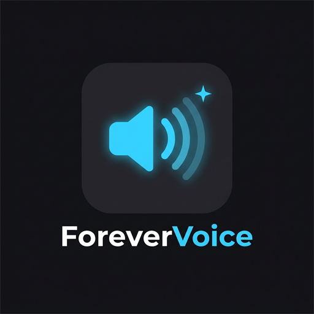
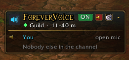
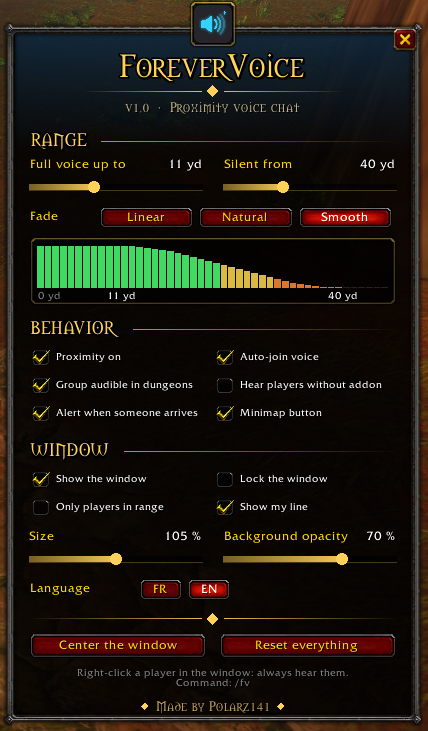

# ForeverVoice

**Proximity voice chat for your guild in World of Warcraft: Forever.**

-c8a14a)

---

Walk into a zone, cross a guildmate on the road, and just talk to them. ForeverVoice turns
Blizzard's built-in voice chat into **proximity voice**: you hear the players close to you, their
voice fades as they walk away, and they go silent once they are out of range.

No external program, no Discord, no server to host. ForeverVoice uses the game's own voice
chat and only changes how loud each player is. No libraries, no dependencies.

&nbsp;

## How it works

1. ForeverVoice joins the voice channel you picked when you log in: your **guild**, your
   **group**, or **Auto** (the guild, else the group).
2. Every player who has the addon shares their position with the guild, using a small hidden
   addon message.
3. Your addon sets the volume of **each player** based on how far they are: full voice up
   close, a smooth fade, then silence.

> **Everyone needs the addon.** Proximity is applied on the listener's side. A guildmate
> without ForeverVoice doesn't share their position, and hears the whole channel at normal volume.

## Features

- **Proximity volume**: full voice up to a distance you choose, then a fade (linear, natural
  or smooth), with silence past the maximum range. A live graph in the options shows the curve.
- **"X is in voice range" alert**: a sound and a message when a guildmate comes within earshot.
- **Group audible in dungeons**: the game hides positions in dungeons and battlegrounds, so
  your group stays audible there.
- **Always hear someone**: right-click a player in the window to hear them at any distance,
  for example a friend or a raid leader.
- **Voice window**:
  - who is in the channel and who is talking;
  - how far each player is and how loud you hear them;
  - your own line with your push-to-talk key.
- **Minimap button** with a tooltip listing who is in range, and a halo while someone talks.
- **Guild or group**: pick the voice channel in the options (Auto, Guild or Group). In Group mode,
  you join group voice as soon as a group forms.
- **Join and leave voice** in one click.
- **English and French**, switched in one click.
- **Settings that stick**, even with the Forever beta bug that resets addon settings (see
  below).
- **Safe**: ForeverVoice only changes volumes, never the Blizzard mute. Everyone is put back to
  full volume when you turn proximity off, leave voice or log out.

## Controls

**Minimap button**

| Action | Effect |
| --- | --- |
| Left-click | Options menu |
| Right-click | Proximity on / off |
| Middle-click | Join / leave voice |
| Shift + click | Show / hide the window |
| Drag | Move the button around the minimap |

**Slash commands**

| Command | Description |
| --- | --- |
| `/fv` | Show / hide the window |
| `/fv options` | Open the options menu |
| `/fv on` / `/fv off` | Turn proximity on / off |
| `/fv join` / `/fv leave` | Join / leave voice |
| `/fv join guild` / `/fv join group` | Switch to guild or group voice |
| `/fv range 40 8` | Silent from 40 yards, full voice up to 8 yards |
| `/fv debug` | Voice, positions and settings backup status |

## Options

| Section | What you can change |
| --- | --- |
| Range | Full voice distance (0-30 yd), silent distance (10-100 yd), fade curve with a live graph, volume up close |
| Behavior | Voice channel (Auto, Guild, Group), proximity on / off, auto-join voice, group audible in dungeons, hear players without the addon, in-range alert, minimap button |
| Window | Show, lock, only players in range, your own line, size, background opacity |

## Installation

1. Download the latest version.
2. Extract the `ForeverVoice` folder into your WoW Forever `Interface\AddOns` directory:
   `World of Warcraft\<Forever folder>\Interface\AddOns\ForeverVoice`
3. In the game settings, turn on **Voice Chat** and pick your microphone and your talk mode
   (push-to-talk or open mic).
4. Log in: ForeverVoice joins guild voice by itself. Ask your guildmates to install it too.

## About the Forever beta saving bug

During the WoW Forever beta, the client writes addon settings at logout but never reads them back
after a relog or a restart, so every addon starts from defaults. ForeverVoice keeps two extra copies of
its settings:

- **Addon CVars**: they stay in memory while the game runs, which covers a relog.
- **One account macro named `ForeverVoice`**: macros are stored by the server, so they are still
  there after a restart. It holds a single line of settings and does nothing if you click it.
  If you delete it, ForeverVoice puts it back a few seconds later.

The list of "always heard" players doesn't fit in the macro, so it is only kept until the game is closed.

## Compatibility

- **World of Warcraft: Forever**: 1.60.x, Interface `16001`
- Blizzard voice chat must be enabled in the game settings.

## Changelog

See [CHANGELOG.md](CHANGELOG.md).

---

Made by **Polarz141**

